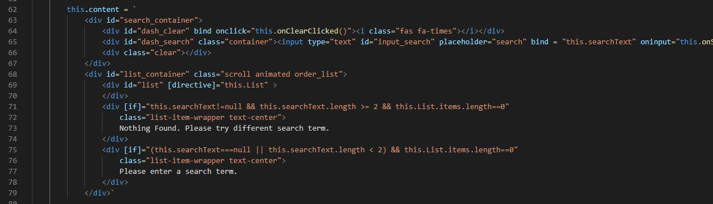

# leet-html README

This is a fork of lit-html extension that does not require html prefix before the literal template symbol (`)

## Features

Works like this:

> Tip: Many popular extensions utilize animations. This is an excellent way to show off your extension! We recommend short, focused animations that are easy to follow.

## Release Notes

### 1.0.0
Initial release